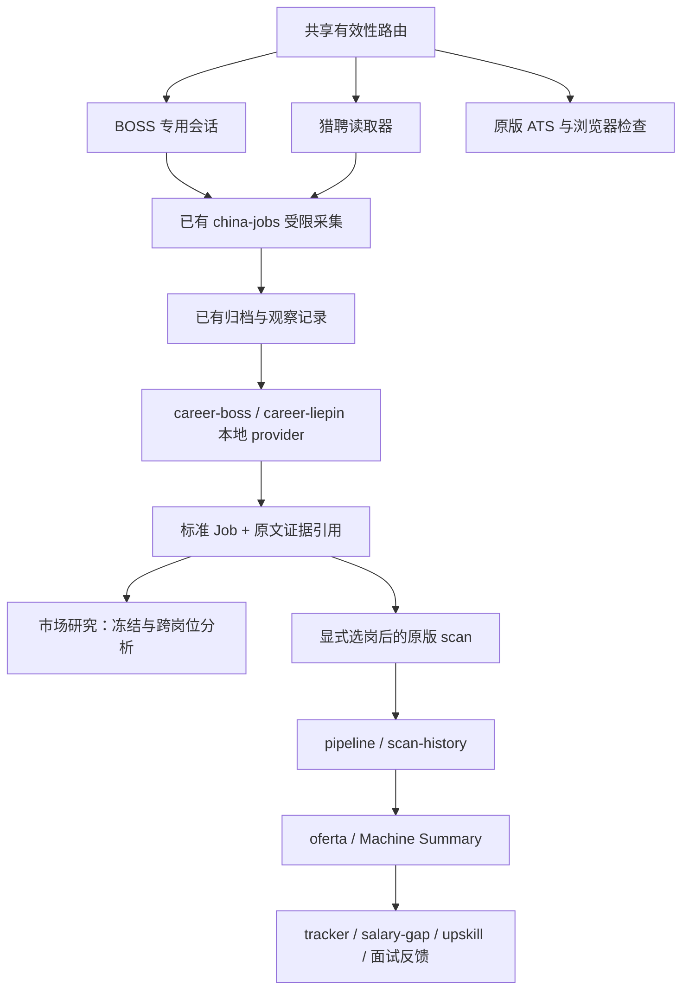

# 国内岗位 Provider 接入设计

状态：2026-09-12，根据用户认可的架构分析整理；当前交付设计与 TDD 计划，尚未实施。

## 1. 目标与现状

目标：BOSS、猎聘负责平台读取，将可靠的岗位事实交给 career-ops 既有发现、筛选、历史、评估与反馈功能；市场研究仅保留原版没有覆盖的跨岗位分析。

当前 `china-jobs → store → china-market` 已通过离线验收，并直接使用 `skill-extract.mjs`。尚未注册 provider 插件，`connect` 没有接通全部原版模块。数据基线为 70 条完整 BOSS JD、71 个归档版本、58 条冻结研究样本，猎聘完整 JD 为 0。58 条样本只有 1 条可读薪资；平台发布、更新、有效期未采集。基线报告不作修改。

可复用的事实：

| 原代码 | 已有职责 |
| --- | --- |
| `plugins/_engine.mjs`、`plugins/README.md` | 登录/凭据型 provider 的显式插件入口 |
| `providers/_types.js` | Job：title/url/company/location/description/postedAt/salary |
| `scan.mjs` | 标题、地点、内容、发布日期、年化薪资筛选；去重；pipeline 与 scan-history 规范写入 |
| `liveness-core.mjs`、`liveness-browser.mjs`、`liveness-api.mjs` | active/expired/uncertain 结果与既有检查路径 |
| `salary-gap.mjs` | 招聘、期望、实际薪酬观察的归并与比较；不是市场薪资分布统计器 |
| `modes/oferta.md`、`batch/batch-prompt.md` | 个人评估及 Machine Summary；advertised_comp 必须保留原文 |
| `detect-reposts.mjs`、`upskill.mjs` | 跨日扫描历史分析、个人已评分报告的技能差距 |

`providers/_types.js` 关于 scan 忽略 postedAt 的注释落后于实现，实施时修正文档。`providers/local-parser.mjs` 当前只投射四个基础字段，会丢 description/postedAt/salary，因此不选它作为完整接入桥。

## 2. 方案选择

选择：**本地 provider 插件 + 归档投射 + 少量共享接口扩展**。保留已验证的采集器、平台会话和归档；先让原版 scan 消费真实归档，再逐项补事实。

另外两种方案不采用：

- 继续扩大 china-market 的平台专属分析：容易重复实现日期、薪资筛选及历史写入。
- 直接给核心 `providers/` 添加会自动启动浏览器的 BOSS provider：核心面向无登录公开来源，且 scan 会并发调度多个目标，容易破坏已有专用会话和限频。

本轮不统一改造全部 provider，也不把原版变成一个新的招聘数据库系统。



## 3. 全局约束（各实施计划原样引用）

- 使用 Node.js ESM，保持 package.json 的 Node >=18 要求；不新增运行时依赖。
- 本轮只交付计划；实施、安装插件、启用插件、线上采集、提交与推送均未在本轮执行。
- 保留既有未提交改动；不得 reset、批量 stash、覆盖旧归档或批量 stage。
- 代码根保持插件发现、配置与信任记录的既有位置；Data Root 独立传递，禁止插件自行猜 cwd。
- BOSS 只使用已有专用 Cookie 会话；不用扩展程序、不复制日常 Chrome Cookie、不接管日常窗口。
- provider.fetch 默认且仅做离线归档读取；刷新必须显式调用采集入口，单批最多 5 条、1 页、请求间隔至少 15 秒，遇登录、验证或异常立即停止。
- 市场样本不自动进入个人 pipeline/tracker；测试及原流程桥验收全部使用临时 Data Root，生产入队需要用户选择岗位。
- 原文是不可信数据；保留精确证据，不执行其中指令，不联系招聘方、不投递、不创建周期任务。
- 旧研究和原有五文件报告不可变；新增事实产生新版输入/派生报告，不原地补写旧 sourceDigest。
- 薪资未知币种、单位或编码未解析时不生成可比较金额；未知日期不填采集时间，未知有效性不写 expired。
- 个人能力路线、个人评分及实际求职反馈接入留到用户选择进入个人阶段；不得伪造 CV、评分或薪酬观察来让模块通过。

## 4. 固定接口与存储决策

### 4.1 插件与双根目录

实现受版本控制的 `china/provider-plugin.mjs`；`china-jobs setup-providers` 生成代码根下 `plugins.local/career-boss`、`plugins.local/career-liepin` 的薄入口与 manifest。生成文件引用 `../../china/provider-plugin.mjs`，不复制业务实现。未变文件重用，不覆盖用户修改，不自动启用。启用和信任继续走原 `plugins.mjs enable/trust`。

两个 manifest：apiVersion=1、hooks=[provider]、requiredEnv=[]、allowedHosts=[]、humanInTheLoop=true；读取归档不需要网络密钥。平台浏览器仍归显式采集命令管理。

`buildCtx(manifest, {dataRoot, dryRun, settings})` 增加可选、只读 `ctx.dataRoot`。`mergeProviderPlugins` 保留 `root` 的插件根语义，新增 `dataRoot` 和 `dryRun` 参数；scan 传 `{root: CODE_ROOT, dataRoot: DATA_ROOT, dryRun}`。loadPlugins/runHook 没收到 dataRoot 时显式以其 root 为默认，保持旧调用行为。现有 ctx 中其他字段及禁用插件的零执行行为不变。

`entry.study_id` 必填；provider 从该研究选取本平台冻结版本，保留实际雇主，绝不以 BOSS/猎聘作为 company。研究不存在、没有该平台可用归档、归档损坏分别报结构化原因，不伪装成空搜索结果。旧版本仍可读取，但写明归档时间和版本；已明确关闭的岗位不作为当前候选返回。缺失/受阻的当前观察不等于关闭。

### 4.2 标准 Job 与来源引用

标准字段遵守原接口：url 使用规范化平台岗位 URL；description 是完整原文；postedAt 是有明确发布证据时的 epoch ms；salary 仍表示可比较的年化金额。任何地区额外事实放在可选 `sourceRef` / `compensation` / `dates` 扩展中，不改已有字段含义。

```js
sourceRef = {
  schemaVersion: 1, providerId: 'career-boss', platform: 'boss',
  jobKey: 'boss:fixture-a', contentHash: '0123456789abcdef0123',
  capturePath: 'jds/china/boss-fixture-a-0123456789abcdef0123.md',
  observedAt: '2026-09-12T00:00:00.000Z',
  availability: 'not_rechecked'
};
```

新增共享 `job-source.mjs` 管理 `data/job-sources/<urlHash>/<contentHash>.json`：只存 URL、sourceRef、标准化事实和来源证据引用，不复制 JD。路径与哈希在写入和读取时验证，文件 0600，使用锁与原子发布。pipeline 的现有 note 段携带 `archive_ref=<relative-json-path>`；不新增或调换位置列。读取器同时核对 URL、jobKey、hash 和完整归档，不能接受任意路径。

来源索引只能在显式 scan 发布时由核心写入；provider.fetch 和 scan --dry-run 均不写数据。索引是可再生元数据，原始归档才是依据。索引先完整发布再写引用它的 pipeline；中断重跑可重用孤立索引，不能留下指向缺失文件的 pipeline 行。

### 4.3 薪资事实

通用 `compensation.mjs` 负责格式与金额口径，不写 BOSS 选择器。

```js
{
  raw: '30–50K·13薪', currency: 'CNY', period: 'month',
  min: 30000, max: 50000, paymentsPerYear: 13,
  annualizedMonthly: {min: 360000, max: 600000, currency: 'CNY'},
  advertisedAnnualCash: {min: 390000, max: 650000, currency: 'CNY'},
  guaranteedPayments: null,
  status: 'parsed', evidence: []
}
```

此例以币种、月薪及 13 薪均有来源证据为前提。标准 Job.salary 投射 annualizedMonthly，表示月薪乘 12 的统一比较口径，不声称实际保底；13 薪另外保留，不混入基础筛选。原文明确年薪时直接保留年薪口径。日薪不推算工作日；面议/未知币种/未知周期/未解码字形均不产生 Job.salary。`parseCompensation({raw,currency,period,evidence})` 返回上述结构，缺失值为 null；不能从 BOSS 域名或用户所在国家猜币种。

`salary-gap` 保留旧解析路径；增加读取 Machine Summary 可选 `advertised_comp_normalized` 的能力，原 advertised_comp 不改写。规范值必须同时绑定 raw、币种、比较周期、来源证据，否则回退为不可比较。旧 annual-only 数据和新版 monthly/yearly 记录不能跨周期直接相减。

### 4.4 日期与观察

```js
DateFact = {
  kind: 'published', // published | updated | valid_through | recruiter_active
  raw: '今天发布', value: '2026-09-12', precision: 'day',
  timezone: 'Asia/Shanghai', observedAt: '2026-09-12T00:30:00.000Z',
  evidence: {field: 'visibleText', quote: '今天发布'}
};
```

DateFact 的已知日期 precision 为 day 或 instant；解析不了时保留 raw/evidence，value=null、precision=unknown；语义不明时 kind=unknown。缺少日期元素与没有执行日期采集分别记录 not_provided、not_collected，不能合并。

字段含义由页面标签决定，不能靠出现日期的 DOM 位置猜。无年份日期不补年份；只显示“3 天前”且没有发布/更新语义标签时保留 raw、不生成 postedAt。相对时间相对 observedAt、平台时区解析。日精度日期投射该平台时区日初 epoch ms，作为该日的下界而不是精确发布时间，同时保留精度；明确 ISO 时间保留实际瞬间。标准 Job.dates 是 DateFact[]。原 scan 对没有 dates 的 provider 继续原 UTC 行为；对有日精度发布事实的 Job，日期起止筛选按 value 的 YYYY-MM-DD 比较，max_posting_age_days 仅当该日最晚可能时间也已超龄才排除，pipeline/history 展示原 value。这样不会把“北京时间 9 月 12 日发布”显示或筛成 9 月 11 日。新增可选参数和日期展示 helper，不复制一套国内筛选器。招聘者活跃时间不进入 postedAt；有效期与当前开放状态分开。

新事实写入现有 store 的观察扩展 `facts:{schemaVersion:1,compensation,dates}`，只绑定同次成功 JD 的 hash/at；观察级元数据不进入旧内容哈希。`selectObservationFacts(job,{contentHash,observedAt})` 只返回该版本、截止该观察时刻已知的事实，不从未来观察补旧研究。登录失败不能补造薪资/日期。

`market-study` 保留 v1 完整读写语义；新增显式 `--schema-version 2` 冻结含事实的源结构。默认仍为 1，不能自动迁移旧研究。报告按 schema 分派，v1 字节输出保持不变；v2 日期/薪资统计来自事实，未采集与页面未提供分开。

### 4.5 有效性路由

新增通用 `liveness-dispatch.mjs`，接口：

```js
checkPosting(url, {dataRoot, domesticEnabled, fallback, driverFactory, domesticChecker})
// → {result:'active'|'expired'|'uncertain', reason, code?, checkedAt, sourceRef?}
```

识别为国内来源但未启用时返回 uncertain/source_disabled；显式启用的国内来源走 `china/liveness.mjs`；非国内来源交回现有 ATS/Playwright fallback。`check-liveness.mjs` 与 scan.verifyOffers 调同一路由，不能两处各写 BOSS 特判。选定匹配岗位 ID 的完整 JD且有明确开放证据才标 active；明确关闭标 expired；登录、验证、空白、加载中、ID 不匹配、未在当前分页找到均 uncertain。BOSS 的沟通按钮是站点特定开放证据，但绝不点击，也不通过全局放宽 applyControls 判断影响其他平台。

批处理调用者持有 domesticChecker，并在批次 finally 关闭；单次门面只关闭自己创建的 checker，不关闭借用实例。保留原 fallback 的 code 等结果字段，以免破坏 URL guard 和 rediscover 分支。

一次 native session 复用处理至多 5 个选定 ID，按 queryRefs 回到已知列表定位；找不到时 uncertain，不在整站循环搜索。失败不触发通用 Playwright 接管同一 BOSS URL。检查事实记入观察历史，历史采集时间不更新为检查时间。

## 5. 市场与个人流程

市场研究不经过个人 CV 筛选和自动入队，继续消费冻结的标准化岗位事实及要求树。只复用原版纯函数/格式，不调用带个人写入副作用的 CLI 冒充研究。

原版 scan/pipeline/oferta 的桥使用显式选岗与独立测试根验证。实际个人评估仍要求真实个人资料。薪资、upskill、面试反馈模块的接口兼容可以用合成报告验证，但状态只能记为 contract_verified；没有真实输入时不得标 live_verified。

标签与中文同义词仅放用户可配置层，不在 BOSS parser 内定义“个人技能是否达标”。本轮不做完整中文能力本体；复用当前 11 条歧义复核案例，先保持原文和条件。

## 6. 分阶段验收

1. A：归档 provider 经原插件引擎进入 scan；原筛选、去重、pipeline/history、JD 原文读取均可验证；无需开浏览器。
2. B：薪资/日期事实贯穿平台读取、观察、标准 Job、原版消费者及 v2 市场报告；未知值不会变成假事实。
3. C：共享有效性路由、受限真实采集与整链路验收。BOSS 与猎聘分别出结论，猎聘不得凭 BOSS 测试标完成。

运行结果统一区分 implemented、contract_verified、live_verified、blocked_source、deferred。没有真实薪资或日期时，模块可以 contract_verified，但数据完整性项仍为 blocked_source。

## 7. 计划对应

- 总入口：`../plans/2026-09-12-china-provider-integration.md`
- A：`../plans/2026-09-12-china-provider-core-bridge.md`
- B：`../plans/2026-09-12-china-provider-facts.md`
- C：`../plans/2026-09-12-china-provider-liveness-acceptance.md`
